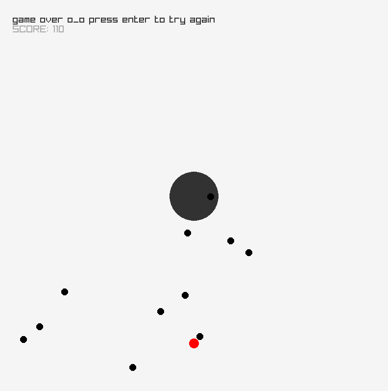

# Jukemajster

A small game made in Raylib. Made with [DawidKmiec](https://github.com/DawidKmiec) during a pair programming session.

You are a <b>red dot</b> bound in an endless struggle against a huge <b>gray dot</b> that spawns mutated, deadly, <b>black dots</b>. Who will prevail?!

Not you, there is no win-scenario defined, so that's that

